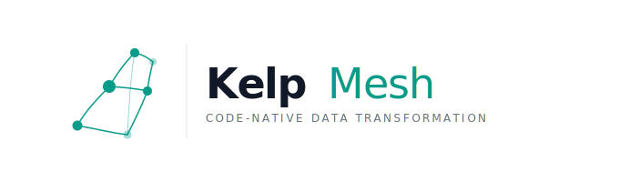

**Code-native data transformation — SQL and Python models, no Jinja required.**

[](LICENSE)
[](https://www.python.org/)

```bash
pip install kelpmesh-core
kelpmesh init my_project && cd my_project
kelpmesh run
```

---

## Why KelpMesh?

dbt models are Jinja-templated SQL. Your files look like this:

```sql
{{ config(materialized='table') }}
SELECT customer_id, {{ surrogate_key(['order_id','sku']) }} AS id
FROM {{ ref('stg_orders') }}
WHERE {{ is_incremental() }}
```

No IDE autocomplete. No AI assistant support. Weeks to learn.

KelpMesh models are plain SQL:

```sql
-- materialized: table
SELECT customer_id, surrogate_key(order_id, sku) AS id
FROM stg_orders
WHERE is_incremental()
```

Works in every SQL editor, every AI tool, every linter — on day one.

---

## Features

### SQL engine

- **Pure SQL models** — no Jinja; files work natively in DBeaver, DataGrip, Cursor, any AI tool
- **32 built-in SQL macros** — `surrogate_key`, `safe_divide`, `datediff`, `haversine`, `generate_surrogate_key`, and 27 more; called as plain SQL functions, expanded at compile time
- **Python models** — `def model(dbt, session)` interface; return SQL string or pandas DataFrame
- **All materializations** — `table`, `view`, `incremental` (merge/append), `ephemeral`, SCD Type 2 snapshots
- **9 warehouse adapters** — DuckDB · Postgres · Snowflake · BigQuery · Databricks · Redshift · Microsoft Fabric · MySQL · Trino
- **Incremental merge** — consistent MERGE/UPSERT API across all 9 warehouses
- **`kelpmesh plan`** — Terraform-style impact analysis before any warehouse query runs
- **`kelpmesh compile`** — render macros and substitutions without touching the warehouse

### CI/CD and version control

- **`kelpmesh ci`** — one command: diff → plan → run changed models → test → post PR comment
- **GitHub PR comments** — posts a structured run report on every PR; updates (not spams) existing comment
- **GitLab MR comments** — same, auto-detected from CI environment variables
- **Bitbucket PR comments** — same
- **Ready-to-use CI templates** — `.github/workflows/ci.yml`, `.gitlab-ci.yml`, `bitbucket-pipelines.yml` included

### Scheduling and orchestration

- **Built-in cron scheduler** — `kelpmesh schedule start`; cron syntax + `every 1h` intervals; no Airflow required
- **Dagster integration** — `KelpMeshResource`, `@asset`, `@op`, schedule sensor
- **Prefect integration** — `KelpMeshBlock`, `@task`, `@flow`, pre-built standard flow
- **Airflow** — `KelpMeshOperator`, `DagFactory`-compatible

### Security (free in Core)

- **PII auto-classification** — 7 types: email, phone, SSN, NPI, card, IP, DOB
- **Row-level security (RLS)** — policy-based access control applied per model
- **Column masking** — per-column masking strategy; format-preserving options
- **GDPR right-to-erasure** — `kelpmesh security erasure` deletes subject data across all models
- **Immutable audit log** — append-only JSONL; every execution recorded
- **Secret scanning** — scans for hardcoded credentials in SQL files
- **Zero telemetry** — import blocklist enforced in code; no phone-home possible

### Tooling

- **VS Code extension** — 37 SQL snippets, model tree view, CodeLens run/test/preview buttons, plan panel
- **dbt migration** — `kelpmesh import` converts models, tests, sources, seeds, snapshots
- **Data mesh** — cross-project `ref()`, public/private access contracts, column guarantees
- **Semantic layer** — metric definitions, BI export for LookML, Tableau, PowerBI, Qlik

---

## Quickstart

```bash
# Install
pip install kelpmesh-core

# Create a project
kelpmesh init my_project
cd my_project

# Run all models
kelpmesh run

# Preview 100 rows from a model
kelpmesh preview orders

# See what would change before running
kelpmesh plan

# Test all models
kelpmesh test

# Run + test in one command
kelpmesh build

# Generate documentation site
kelpmesh docs
```

---

## CI/CD — one line in any pipeline

```bash
kelpmesh ci    # detects changed models, runs them, tests, posts PR comment
```

In GitHub Actions — add to your workflow:

```yaml
- name: KelpMesh CI
  run: kelpmesh ci
  env:
    GITHUB_TOKEN: ${{ secrets.GITHUB_TOKEN }}
```

Every PR gets a structured report showing exactly which models were affected, what ran, and whether tests passed — updated automatically on every push.

---

## Packages

| Package | What it is | Price |
|---------|-----------|-------|
| `pip install kelpmesh-core` | Full CLI engine — 9 adapters, 32 macros, scheduler, security, CI/CD | **Free forever** · Apache 2.0 |
| `pip install kelpmesh-studio` | Core + browser dashboard (DAG viz, run history, team features) | **Free** for personal use · **Freemium** for commercial |

`kelpmesh-core` will never have features gated behind a paid tier.

---

## Studio (browser dashboard)

```bash
pip install kelpmesh-studio
kelpmesh studio          # opens http://localhost:8501
```

| Tier | Price | Limits |
|------|-------|--------|
| **Free** — personal use | $0 | 1 user · 3 projects · 50-run history |
| **Pro** — commercial teams | $29/user/mo | 5 seats · unlimited projects · RBAC · API keys · Git sync · AI BYOK |
| **Business** — large orgs | $79/user/mo | Unlimited seats · SSO · BYOC · full audit log |
| **Enterprise** | Contact us | On-premises · custom SLA · dedicated support |

Activate with:

```bash
export KELPMESH_STUDIO_LICENSE_KEY=km_pro_<your-key>
kelpmesh studio
```

---

## Warehouse support

```bash
# kelpmesh.yml
warehouse:
  type: duckdb          # zero install, great for local development
  path: ./warehouse.db

# Per-warehouse extras:
# pip install kelpmesh-core[postgres]
# pip install kelpmesh-core[snowflake]
# pip install kelpmesh-core[bigquery]
# pip install kelpmesh-core[databricks]
# pip install kelpmesh-core[redshift]
# pip install kelpmesh-core[mysql]
# pip install kelpmesh-core[trino]
# pip install kelpmesh-core[all-warehouses]   # everything at once
```

---

## Security

```bash
# Scan for hardcoded credentials
kelpmesh scan secrets --fail

# Classify PII columns in your warehouse
kelpmesh security classify --table orders

# Apply column masking by role
kelpmesh security mask --table users --columns email,phone --role viewer

# GDPR erasure
kelpmesh security erasure --id-col email --id-value user@example.com

# View audit trail
kelpmesh security audit
```

---

## Migrate from dbt or SQLMesh

KelpMesh auto-detects the source project format. No `--from` flag needed in most cases.

```bash
# From dbt
kelpmesh import ./dbt-project --output ./kelpmesh-project

# From SQLMesh
kelpmesh import ./sqlmesh-project --output ./kelpmesh-project

# Explicit (if auto-detection doesn't pick it up)
kelpmesh import ./my-project --from dbt
kelpmesh import ./my-project --from sqlmesh
```

### dbt → KelpMesh

| dbt | KelpMesh |
|-----|----------|
| `{{ ref('model') }}` | plain table name (auto-resolved by AST) |
| `{{ source('src', 'tbl') }}` | plain table name |
| `{{ config(materialized='table') }}` | `-- { materialized: table }` header |
| `schema.yml` tests (`not_null`, `unique`, `accepted_values`, `relationships`) | SQL assertion files in `tests/` |
| Seeds (CSV) | `seeds/*.sql` with VALUES blocks |
| Snapshots | `models/snapshots/*.sql` with snapshot header |
| dbt packages | Built-in SQL macros or `kelpmesh-utils` |

### SQLMesh → KelpMesh

| SQLMesh | KelpMesh |
|---------|----------|
| `MODEL (name ..., kind FULL)` block | `-- { materialized: table }` header |
| `kind INCREMENTAL_BY_UNIQUE_KEY (unique_key id)` | `-- { materialized: incremental, unique_key: id }` |
| `grain payment_id` | `-- { unique_key: payment_id }` |
| `audits (UNIQUE_VALUES(...), NOT_NULL(...))` | SQL assertion files in `tests/` |
| `cron '@daily'` | `-- { cron: @daily }` |
| `@execution_dt` | `CURRENT_DATE` |
| `@start_dt` / `@end_dt` | `CURRENT_DATE - INTERVAL '7 days'` / `CURRENT_DATE` |
| YAML unit test fixtures (`inputs`/`outputs`) | Smoke tests (recreate with `kelpmesh create_test`) |
| `audits/*.sql` | `tests/*.sql` SQL assertions |
| `config.py` / `config.yaml` | `kelpmesh.yml` |

> **SQLMesh note:** SQLMesh YAML unit tests use an input/output fixture format that requires running a live warehouse query to generate. After import, use `kelpmesh create_test <model>` to recreate them properly.

---

## Integrations

| Tool | How |
|------|-----|
| **GitHub Actions** | `kelpmesh ci` + built-in workflow at `.github/workflows/ci.yml` |
| **GitLab CI** | `kelpmesh ci` + template at `.gitlab-ci.yml` |
| **Bitbucket Pipelines** | `kelpmesh ci` + template at `bitbucket-pipelines.yml` |
| **Dagster** | `from kelpmesh_dagster import KelpMeshResource` |
| **Prefect** | `from kelpmesh_prefect import KelpMeshBlock` |
| **Airflow** | `pip install kelpmesh-airflow` |
| **VS Code** | Search "KelpMesh" in extensions marketplace |
| **pre-commit** | `.pre-commit-hooks.yaml` included |

---

## Community

- [GitHub Issues](https://github.com/RoyPulseAI/kelpmesh/issues) — bug reports and feature requests
- [Discord](https://discord.gg/kelpmesh) — community chat and support
- [Twitter / X](https://x.com/kelpmesh_dev) — updates and releases

---

## Development

```bash
git clone https://github.com/RoyPulseAI/kelpmesh
cd kelpmesh
pip install -e ".[dev]"
pytest tests/ -v
```

See [CONTRIBUTING.md](CONTRIBUTING.md).

---

## Author

KelpMesh is designed and built by **Roy Pulse AI** ([@RoyPulseAI](https://github.com/RoyPulseAI)).

## License

`kelpmesh-core` — Apache 2.0  
`kelpmesh-studio` — Apache 2.0 (free tier) · Commercial license (Pro/Business/Enterprise)

See [LICENSE](LICENSE).
